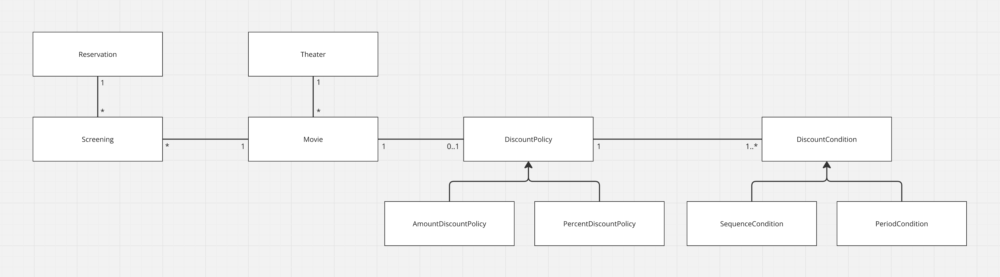
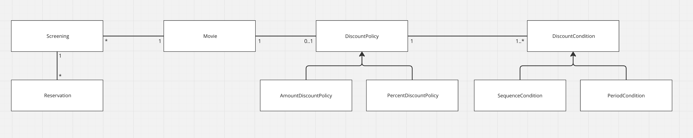
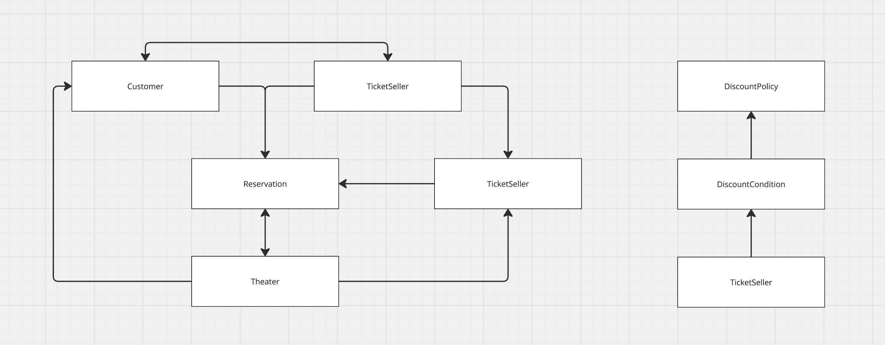

## 영화 예매 애플리케이션

### 요구사항
* 영화와 상영이란 용어를 구분한다.
* 영화는 영화에 대한 기본 정보를 일컫는다.
  * 제목, 상영시간, 가격 정보
* 상영은 실제로 관객들이 영화를 관람하는 사건을 표현한다.
  * 상영 일자, 시간, 순번
* 하나의 영화는 하루 중 다양한 시간대에 걸쳐 한 번 이상 상영될 수 있다.
* 예매자는 요금을 할인받을 수 있고, 할인액을 결정하는 2가지 규칙이 존재한다.
  * 할인 조건: 가격의 할인 여부를 결정하며 순서 조건과 기간 조건 2종류가 있다.
    * 순서 조건: 상영 순번을 이용해 할인 여부를 결정한다.
    * 예를 들어 매일 10번째로 상영되는 영화를 10번의 순번을 가진 예매자들에게 할인해준다.
    * 기간 조건: 영화 상영 시작 시간을 이용해 할인 여부를 결정한다.
    * 기간 조건은 요일, 시작 시간, 종료 시간 3부분으로 구성되며 영화 시작 시간이 해당 기간안에 포함될 경우 할인한다.
    * 예를 들어 월요일 오전 10시 ~ 오후 1시 상영되는 영화를 할인한다.
  * 할인 정책: 할인 요금을 결정한다.
    * 금액 할인 정책: 예매 요금에서 일정 금액을 할인해주는 방식
    * 비율 할인 정책: 정가에서 일정 비율의 요금을 할인해주는 방식
    * 예를 들어 어떤 영화의 가격이 9000원이고, 금액 할인 정책이 800원일 경우 예매 가격은 8200원이다.
    * 만약 비율 할인 정책이 10%일 경우 예매 가격은 8100원이다.
    * 영화별로 할인 정책은 1가지만 적용되지만 할인 조건은 n개가 적용될 수 있다.
  * 할인을 적용하기 위해선 할인 조건과 할인 정책을 조합해서 사용한다.
    1. 사용자의 예매 정보가 만족하는 할인 조건이 있는지 확인한다.
        * 만족할 경우 할인 정책으로 할인 요금을 계산한다.
        * 정책은 적용되어 있지만 조건을 만족하지 못하거나 정책이 적용돼있지 않다면 할인하지 않는다.
* 사용자가 예매를 완료하면 시스템은 예매 정보를 생성한다.
  * 제목, 상영정보, 인원, 정가, 결제 금액

### 혼자서 설계 해보기

* Theater: 극장(예매 사이트)을 나타내는 객체이다.
  * 극장은 상영관을 관리한다.
  * 극장을 통해 예매자는 예매를 진행할 수 있다.
    * 예매를 완료하면 예매 정보를 생성한다.
  * 극장은 예매자가 입장이 가능한지 검수 과정을 진행햐야한다.
  * 극장은 오픈 시 금일 상영할 영화를 등록해야한다.
* Movie: 영화를 나타내는 객체이다.
  * 영화에 대한 기본 정보 그리고 할인 정책, 할인 조건을 가진다.
  * 영화에 대한 할인 여부를 책임진다.
    * 할인 정책은 할인 조건이 만족할 경우 할인 요금을 계산한다.
* Screening: 상영관을 나타내는 객체이다.
  * 상영관에 대한 정보, 상영 타임 슬롯, 좌석 정보를 가진다.
  * 상영관은 영화를 참조하여 금일 어떤 영화를 상영할지 알 수 있다.
  * Seat: 좌석을 나타내는 객체이다.
    * 좌석에 대한 정보를 가진다.
    * 좌석은 상영관에 속해있다.
* Reservation: 예매를 나타내는 객체이다.
  * 예매 정보를 가진다.
  * 상영관과 예매자를 연결해준다.
* TicketHolder: 예매자를 나타내는 객체이다.

---

## 책 예제

* Movie: 영화
  * 제목, 상영시간, 기본 요금, 할인 정책을 인스턴스 변수로 갖는다.
* Screening: 상영
  * 사용자들이 예매하는 대상이다.
  * 상영할 영화, 순번, 상영 시작 시간을 인스턴스 변수로 갖는다.
  * 상영 시작 시간을 반환하는 행위
  * 순번의 일치 여부를 검사하는 행위
  * 기본 요금을 반환하는 행위
* DiscountPolicy: 할인 정책
  * AmountDiscountPolicy: 금액 할인 정책
  * PercentDiscountPolicy: 비율 할인 정책
* DiscountCondition: 할인 조건
  * SequenceCondition: 순번 조건
  * PeriodCondition: 기간 조건
* Reservation: 예매
  * 고객, 상영 정보, 예매 요금, 인원 수를 인스턴스 변수로 갖는다.

## 오브젝트 예제
