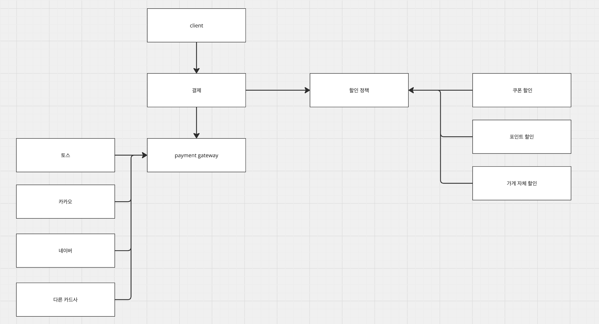

# 정산 도메인

## 역할
정산 도메인은 다음과 같은 하위 도메인들로 구성된다.

- 쿠폰
- 포인트
- 결제

총 3가지의 도메인으로 구성되며, 외부 도메인으로부터의 요청을 통해 할인, 정산 등에 대한 책임을 가진다.

## 쿠폰
쿠폰은 유저에게 발급되는 할인 쿠폰을 의미한다. 쿠폰은 다음과 같은 속성을 가진다.

## 포인트

## 결제

## 결제 전략

1. client에서 결제 요청을 보낸다.
2. 결제 요청을 받은 서버는 할인 정책을 통해서 할인을 적용한다.
3. 할인이 적용된 금액을 payment gateway 서버에 전달한다.
4. payment gateway 서버는 결제를 진행하고 결과를 client에 전달한다.